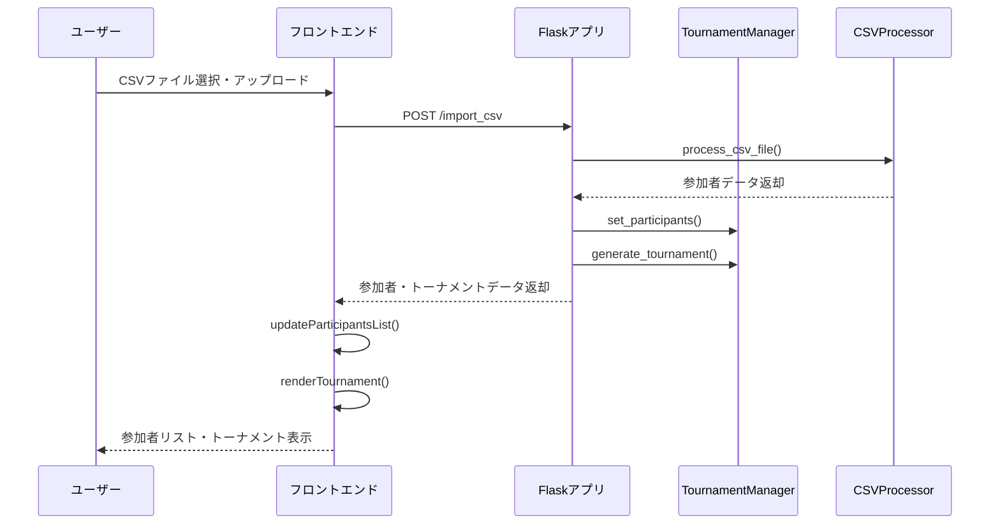
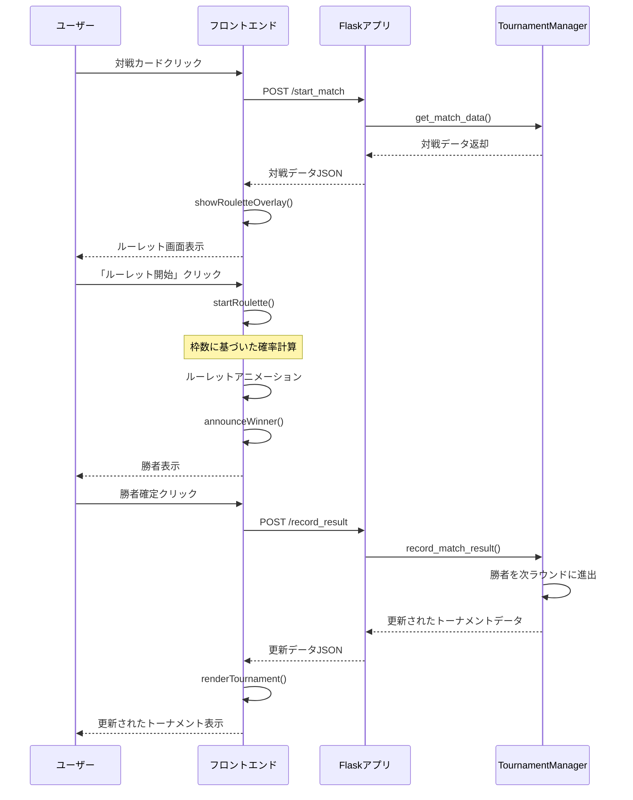

# 最強管理者権限争奪戦 - システム仕様書

## 1. 概要

### 1.1 システム名
**最強管理者権限争奪戦 - モデレーターバトロワルーレット**

### 1.2 システム目的
本システムは、参加者の「枠数」に基づいた確率的なルーレット対戦を通じて、公平で楽しいトーナメント形式のイベントを運営するためのWebアプリケーションです。

### 1.3 対象ユーザー
- イベント運営者（管理者）
- トーナメント参加者（観覧）

---

## 2. 機能要件

### 2.1 参加者管理機能

#### 2.1.1 CSVファイルインポート
| 項目 | 内容 |
|------|------|
| 機能概要 | CSVファイルから参加者情報を一括登録 |
| 入力形式 | UTF-8エンコーディングのCSVファイル |
| ファイル構造 | `参加者名,枠数` の2列形式 |
| バリデーション | 参加者名：必須、枠数：1以上の正の整数 |
| 最大参加者数 | 100名（警告あり、処理は続行） |

**CSVファイル例：**
```csv
参加者A,5
参加者B,3
参加者C,2
```

#### 2.1.2 参加者リスト表示
- 登録された参加者の一覧表示
- 各参加者の枠数表示
- シード参加者のバッジ表示
- 参加者数のカウント表示

#### 2.1.3 自動シード設定
- 奇数人数の場合、ランダムに1名をシードとして選出
- シード参加者は特別な「2倍」との対戦が設定される
- シード勝利時、枠数が2倍になる

---

### 2.2 トーナメント生成機能

#### 2.2.1 トーナメント形式自動選択

| 参加者数 | トーナメント形式 |
|---------|---------------|
| 30名以下 | 1対1 シングルエリミネーション |
| 30名超 | 3人対戦形式（初回のみ3人、以降1対1） |

#### 2.2.2 1対1形式トーナメント（30名以下）
- 参加者をランダムにシャッフル
- 2人ずつペアリングして対戦カードを作成
- シード参加者は「2倍」との特殊対戦
- 必要なラウンド数を自動計算

#### 2.2.3 3人対戦形式トーナメント（30名超）
- 初回ラウンドのみ3人対戦
- 2回戦以降は1対1対戦
- シード参加者は2回戦から参加
- 1人だけのグループは自動進出（枠数2倍）

---

### 2.3 ルーレット対戦システム

#### 2.3.1 勝率計算
勝率は各参加者の枠数に基づいて確率的に計算されます。

**計算式：**
```
参加者の勝率 = 参加者の枠数 / 全参加者の枠数合計
```

**例：**
- 参加者A（枠数5）、参加者B（枠数3）の場合
  - 参加者A勝率: 5 / (5+3) = 62.5%
  - 参加者B勝率: 3 / (5+3) = 37.5%

#### 2.3.2 ルーレットアニメーション
- SVGを使用した円形ルーレット
- 枠数に比例したセグメントサイズ
- Anime.jsによるスムーズな回転アニメーション
- 5秒間の回転後、勝者のセグメントで停止

#### 2.3.3 枠数吸収システム
- 勝者は敗者の枠数を吸収
- 新しい枠数 = 勝者の枠数 + 敗者の枠数の合計
- 次のラウンドでは増加した枠数で勝率計算

#### 2.3.4 特殊対戦
| 対戦タイプ | 条件 | 効果 |
|-----------|------|------|
| シード対戦 | 参加者が1人のみ | 自動進出、枠数2倍 |
| 2倍対戦 | シード参加者 vs 「2倍」 | 勝利時、枠数2倍 |

---

### 2.4 進行管理機能

#### 2.4.1 対戦状態管理
| 状態 | 説明 |
|------|------|
| 未対戦 | 参加者が揃い、対戦可能 |
| 対戦中 | ルーレット実行中 |
| 対戦済み | 勝者が確定 |
| 待機中 | 参加者が揃っていない |

#### 2.4.2 自動進出処理
- 勝者は次のラウンドの対戦枠に自動配置
- 対戦順序に基づいて次の対戦を決定
- シード参加者は均等に分配

#### 2.4.3 優勝者確定
- 最終ラウンドの勝者が優勝者
- 優勝者表示とお祝いメッセージ

---

### 2.5 データ永続化機能

#### 2.5.1 自動保存
- トーナメントデータはJSON形式で保存
- 参加者設定、対戦結果記録時に自動保存
- ファイル名: `tournament_data.json`

#### 2.5.2 自動復元
- アプリケーション起動時に保存データを読み込み
- 中断したトーナメントを継続可能

#### 2.5.3 リセット機能
- 全トーナメントデータの初期化
- 確認ダイアログ表示後に実行

---

## 3. 非機能要件

### 3.1 パフォーマンス要件
| 項目 | 要件値 |
|------|--------|
| API応答時間 | 2秒以内 |
| 同時接続数 | 最大10ユーザー |
| ルーレットアニメーション | 5秒間 |

### 3.2 可用性要件
| 項目 | 要件値 |
|------|--------|
| 稼働率 | 99%以上 |
| エラー処理 | 適切なエラーメッセージとログ出力 |

### 3.3 ユーザビリティ要件
- レスポンシブデザイン（モバイル・タブレット・デスクトップ対応）
- ダークテーマUI
- 直感的な操作インターフェース
- 視覚的なトーナメント表表示

### 3.4 セキュリティ要件
- 全ユーザー入力のバリデーション
- CSVファイル形式のみアップロード許可
- セッション管理によるセキュリティ確保

---

## 4. システムアーキテクチャ

### 4.1 システム構成図

```
┌─────────────────────────────────────────────────────────────┐
│                      クライアント層                          │
│  ┌───────────────┐  ┌───────────────┐  ┌───────────────┐   │
│  │   HTML/CSS    │  │  JavaScript   │  │    D3.js      │   │
│  │  Bootstrap 5  │  │   Anime.js    │  │  (トーナメント) │   │
│  └───────────────┘  └───────────────┘  └───────────────┘   │
└─────────────────────────────────────────────────────────────┘
                              │
                              ▼ HTTP/JSON
┌─────────────────────────────────────────────────────────────┐
│                       サーバー層                             │
│  ┌───────────────────────────────────────────────────────┐  │
│  │                   Flask Application                    │  │
│  │  ┌─────────────┐  ┌─────────────┐  ┌─────────────┐    │  │
│  │  │   Routes    │  │   Session   │  │   Logging   │    │  │
│  │  └─────────────┘  └─────────────┘  └─────────────┘    │  │
│  └───────────────────────────────────────────────────────┘  │
│                              │                               │
│  ┌───────────────────────────────────────────────────────┐  │
│  │                  ビジネスロジック層                      │  │
│  │  ┌─────────────────┐     ┌─────────────────┐          │  │
│  │  │ TournamentManager│     │  CSVProcessor   │          │  │
│  │  └─────────────────┘     └─────────────────┘          │  │
│  └───────────────────────────────────────────────────────┘  │
└─────────────────────────────────────────────────────────────┘
                              │
                              ▼
┌─────────────────────────────────────────────────────────────┐
│                       データ層                               │
│  ┌───────────────────────────────────────────────────────┐  │
│  │              tournament_data.json                      │  │
│  └───────────────────────────────────────────────────────┘  │
└─────────────────────────────────────────────────────────────┘
```

### 4.2 技術スタック

| カテゴリ | 技術 | バージョン |
|---------|------|-----------|
| バックエンド | Python | 3.11+ |
| Webフレームワーク | Flask | 3.1.0+ |
| データ処理 | Pandas | - |
| フロントエンド | Bootstrap | 5.x |
| トーナメント描画 | D3.js | 7.x |
| アニメーション | Anime.js | 3.2.1 |
| アイコン | Font Awesome | 6.4.0 |

---

## 5. API仕様

### 5.1 エンドポイント一覧

| エンドポイント | メソッド | 機能 |
|---------------|---------|------|
| `/` | GET | メインページ表示 |
| `/import_csv` | POST | CSV参加者インポート |
| `/start_match` | POST | 対戦開始 |
| `/record_result` | POST | 結果記録 |
| `/advance_seed` | POST | シード進出 |
| `/reset_tournament` | POST | トーナメントリセット |

### 5.2 API詳細仕様

#### GET /
**概要:** メインページを表示

**レスポンス:** HTMLページ（参加者リスト、トーナメント表を含む）

---

#### POST /import_csv
**概要:** CSVファイルから参加者をインポート

**リクエスト:**
```
Content-Type: multipart/form-data
csvFile: <CSVファイル>
```

**レスポンス（成功時）:**
```json
{
    "status": "success",
    "message": "10人の参加者を追加しました",
    "participants": [...],
    "tournament_data": {...}
}
```

**レスポンス（エラー時）:**
```json
{
    "status": "error",
    "message": "エラーメッセージ"
}
```

---

#### POST /start_match
**概要:** 指定された対戦を開始

**リクエスト:**
```json
{
    "match_id": "uuid-string"
}
```

**レスポンス（成功時）:**
```json
{
    "status": "success",
    "match_data": {
        "id": "uuid-string",
        "participants": [...],
        "winner": null
    }
}
```

---

#### POST /record_result
**概要:** 対戦結果を記録

**リクエスト:**
```json
{
    "match_id": "uuid-string",
    "winner_id": "uuid-string"
}
```

**レスポンス（成功時）:**
```json
{
    "status": "success",
    "tournament_data": {...},
    "winner": {...}  // 優勝者がいる場合のみ
}
```

---

#### POST /advance_seed
**概要:** シードプレイヤーを次のラウンドに進出

**リクエスト:**
```json
{
    "match_id": "uuid-string"
}
```

**レスポンス（成功時）:**
```json
{
    "status": "success",
    "tournament_data": {...},
    "message": "シードプレイヤーを次のラウンドに進めました"
}
```

---

#### POST /reset_tournament
**概要:** トーナメントをリセット

**レスポンス（成功時）:**
```json
{
    "status": "success",
    "message": "トーナメントがリセットされました"
}
```

---

## 6. データ仕様

### 6.1 参加者データ構造

```json
{
    "id": "uuid-string",
    "name": "参加者名",
    "frames": 5,
    "is_seed": false
}
```

| フィールド | 型 | 必須 | 説明 |
|-----------|------|------|------|
| id | string | ○ | 一意識別子（UUID） |
| name | string | ○ | 参加者名 |
| frames | integer | ○ | 枠数（1以上） |
| is_seed | boolean | ○ | シードフラグ |

### 6.2 特殊参加者データ（2倍対戦相手）

```json
{
    "id": "uuid-string",
    "name": "2倍",
    "frames": 1,
    "is_seed": false,
    "is_special_opponent": true
}
```

### 6.3 トーナメントデータ構造

```json
{
    "rounds": [
        {
            "round": 1,
            "matches": [
                {
                    "id": "uuid-string",
                    "participants": [
                        {...},
                        {...}
                    ],
                    "winner": "uuid-string"
                }
            ]
        }
    ]
}
```

### 6.4 保存データ構造（tournament_data.json）

```json
{
    "participants": [...],
    "tournament_data": {
        "rounds": [...]
    }
}
```

---

## 7. 画面仕様

### 7.1 メインページ構成

```
┌─────────────────────────────────────────────────────────────┐
│                        ヘッダー                              │
│    モデレーターバトロワルーレット                              │
│       最強管理者権限争奪戦                                    │
├─────────────────────────────────────────────────────────────┤
│                       通知エリア                             │
│  （成功/エラーメッセージ表示）                                 │
├───────────────────┬─────────────────────────────────────────┤
│                   │                                         │
│   参加者パネル     │          トーナメント表パネル              │
│                   │                                         │
│  ┌─────────────┐  │  ┌─────────────────────────────────┐   │
│  │ 参加者一覧   │  │  │ トーナメント情報                  │   │
│  │ (スクロール) │  │  │ ・参加者数                       │   │
│  └─────────────┘  │  │ ・ラウンド数                      │   │
│                   │  │ ・対戦形式                        │   │
│  ┌─────────────┐  │  └─────────────────────────────────┘   │
│  │ CSVインポート │  │                                         │
│  └─────────────┘  │  ┌─────────────────────────────────┐   │
│                   │  │ トーナメント表（D3.js SVG）        │   │
│  [リセットボタン]  │  │                                   │   │
│                   │  │ ラウンド1 → ラウンド2 → 決勝      │   │
│                   │  │                                   │   │
│                   │  └─────────────────────────────────┘   │
└───────────────────┴─────────────────────────────────────────┘
│                        フッター                              │
└─────────────────────────────────────────────────────────────┘
```

### 7.2 ルーレット画面（オーバーレイ）

```
┌─────────────────────────────────────────────────────────────┐
│                                                             │
│                      対戦開始                                │
│                                                             │
│        ┌─────────────┐      ┌─────────────┐                │
│        │ 参加者A     │      │ 参加者B     │                │
│        │ 枠数: 5     │      │ 枠数: 3     │                │
│        └─────────────┘      └─────────────┘                │
│                                                             │
│                   ┌─────────────┐                           │
│                   │             │                           │
│                   │   ルーレット  │                           │
│                   │   （円形）    │                           │
│                   │             │                           │
│                   └─────────────┘                           │
│                         ▼                                   │
│                                                             │
│        [ルーレット開始]  [スキップ]  [キャンセル]               │
│                                                             │
└─────────────────────────────────────────────────────────────┘
```

### 7.3 勝者発表画面

```
┌─────────────────────────────────────────────────────────────┐
│                                                             │
│                      🏆 勝者 🏆                              │
│                                                             │
│                       参加者A                                │
│                                                             │
│                       [確定]                                 │
│                                                             │
└─────────────────────────────────────────────────────────────┘
```

---

## 8. 処理フロー

### 8.1 参加者インポートフロー



### 8.2 対戦実行フロー



---

## 9. ファイル構成

```
.
├── app.py                      # メインFlaskアプリケーション
├── main.py                     # エントリーポイント
├── pyproject.toml              # プロジェクト設定
├── tournament_data.json        # トーナメントデータ保存ファイル
├── test_participants.csv       # テスト用参加者データ
├── utils/
│   ├── tournament_manager.py   # トーナメント管理クラス
│   └── csv_processor.py        # CSV処理関数
├── templates/
│   ├── index.html              # メインページテンプレート
│   └── error.html              # エラーページテンプレート
└── static/
    ├── css/
    │   └── styles.css          # カスタムスタイルシート
    └── js/
        ├── roulette.js         # ルーレット機能
        └── tournament.js       # トーナメント表示・操作機能
```

---

## 10. エラーハンドリング

### 10.1 バリデーションエラー

| エラー種別 | エラーメッセージ | 対処 |
|-----------|----------------|------|
| ファイル未選択 | ファイルが選択されていません | CSVファイルを選択してください |
| 形式不正 | CSVファイル形式のみ対応しています | .csv拡張子のファイルを使用 |
| 列数不正 | {行}行目のフォーマットが不正です | 2列形式で記述してください |
| 参加者名未入力 | {行}行目: 参加者名が未入力です | 参加者名を入力してください |
| 枠数不正 | {行}行目: 枠数は1以上の整数である必要があります | 正の整数を入力してください |
| 文字コード不正 | CSVファイルの文字コードが不正です | UTF-8形式で保存してください |

### 10.2 システムエラー

| エラー種別 | HTTPステータス | 対処 |
|-----------|---------------|------|
| ページ不存在 | 404 | error.htmlでエラーページ表示 |
| サーバーエラー | 500 | error.htmlでエラーページ表示 |
| 通信エラー | - | JavaScriptでエラーアラート表示 |

---

## 11. 制限事項

| 項目 | 制限値 |
|------|--------|
| 最大参加者数 | 100名（警告後続行） |
| ファイル形式 | CSVのみ（UTF-8） |
| 同時トーナメント | 1件のみ |
| 対応ブラウザ | モダンブラウザ（Chrome, Firefox, Safari, Edge） |
| JavaScript | 必須（有効化が必要） |

---

## 12. 今後の拡張予定

- [ ] 複数トーナメント同時管理
- [ ] データベース連携（SQLite/PostgreSQL）
- [ ] ユーザー認証機能
- [ ] 統計情報・対戦履歴表示
- [ ] トーナメント結果エクスポート機能（PDF/CSV）
- [ ] リアルタイム更新（WebSocket）
- [ ] 多言語対応

---

## 13. セットアップ手順

### 13.1 依存関係のインストール
```bash
pip install -r requirements.txt
```

### 13.2 アプリケーション起動
```bash
python app.py
```

### 13.3 ブラウザアクセス
```
http://localhost:5000
```

---

## 14. 使用方法

### 14.1 参加者登録
1. CSVファイルを準備（形式: `参加者名,枠数`）
2. 「参加者を追加」ボタンでファイルをアップロード
3. 参加者リストで登録内容を確認

### 14.2 トーナメント実行
1. 自動生成されたトーナメント表を確認
2. 対戦カードをクリックして対戦開始
3. ルーレットで勝者決定
4. 「確定」ボタンで結果を記録し次ラウンドへ

### 14.3 特殊操作
- **シード進出**: 1人対戦の場合、クリックで自動進出（枠数2倍）
- **リセット**: 全データを初期化して新規トーナメント開始

---

## 15. ライセンス・著作権情報

本システムは内部利用目的で開発されています。

---

## 16. 改訂履歴

| バージョン | 日付 | 内容 |
|-----------|------|------|
| 1.0.0 | 2025-03 | 初版作成 |

---

**© 2025 最強管理者権限争奪戦**

